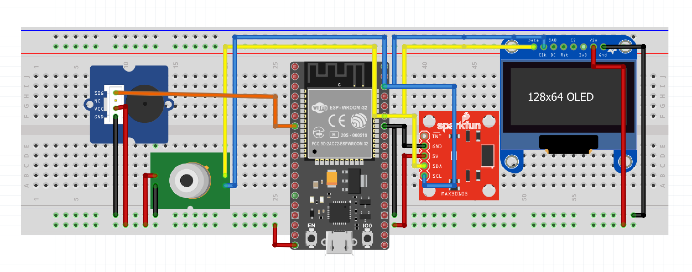
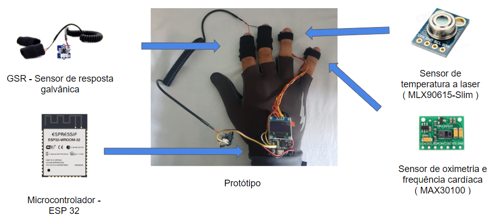

# emotion-physiology

**Affective Computing Course** 

Professor: [Ph.D. Paula Dornhofer Paro Costa](http://www.dca.fee.unicamp.br/~paula)

University of Campinas | UNICAMP
 
 This is a Capstone Project of Affective Computing Course.
 
 The aim of this project is to detect emotion through physiological sensors.
 
 The project has the following main structure:
 
 - [dataset](https://github.com/IA369Y/emotion-physiology/tree/master/dataset)
 - [device](https://github.com/IA369Y/emotion-physiology/tree/master/device)
 - [project](https://github.com/IA369Y/emotion-physiology/tree/master/project)
 
 
 
 
 Shortcuts
 -[Prototype with ESP32](https://github.com/IA369Y/emotion-physiology/tree/master/project/ESP32) 
 -[Mindwave and ThinkGearClient](https://github.com/IA369Y/emotion-physiology/tree/master/device/neurosky/mindwave)
 
 

 Abstract
 The exploratory research on the contribution of physiological data in the detection of emotion comprises in developing an application that assists in the detection of emotions from biomedical measurement. For this, it is necessary to prototype the solution through sensors that can collect relevant data to extract the relation between emotion and physiological signals, which can aid in the detection of emotion. The affective model adopted is the categorical, in which the target categories of study are joy, disgust and fright, in addition to the neutral that is the basis of the analysis. The paper describes the research and development in the field of affective computing on the detection of emotions from biomedical measurement that fulfill the tasks of measuring and collecting vital signs (oximeter, body temperature, heart rate and galvanic response). Remotely, the system is able to capture and process data of an individual's physiological data. To do this, Wi-Fi communication is used to transfer the collected data to a server in the cloud.
 
 Keyword: Affective Computing; Emotion Detection; Emotion; Sentiment; Psychophysiological; Physiological; Biosignals; Biomedical Sensors; Biomedical Measurement; IoT.

