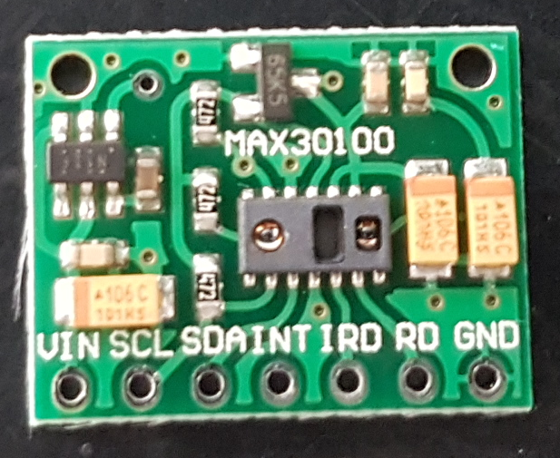

# MAX30100

Arduino Library:

https://github.com/sparkfun/SparkFun_MAX3010x_Sensor_Library

Reference:

English:
https://www.arduinolibraries.info/libraries/max30100lib

https://github.com/sparkfun/SparkFun_MAX3010x_Sensor_Library

https://www.teachmemicro.com/max30100-arduino-heart-rate-sensor/

Portuguese: 
https://www.filipeflop.com/produto/sensor-de-batimento-cardiaco-e-oximetro-max30100/

https://www.youtube.com/watch?v=fMwFfX-B_e8